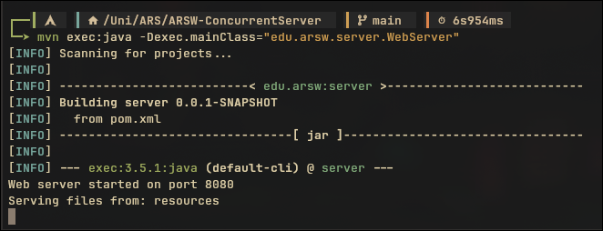

<div align="center">
  
<h1 align="center">Concurrent Web Server</h1>

<p align="center">
simple concurrent web server in Java, capable of serving static files to multiple clients simultaneously using a thread pool to handle requests.
</p>

</div>

</br>


## 🚀 Features

- Concurrent Web Server: Handles multiple client requests at the same time using a thread pool.
- Static File Serving: Capable of serving HTML, CSS, image files, and other file types.
- HTTP Error Handling: Returns appropriate HTTP responses for not found resources (404 Not Found), bad requests (400 Bad Request), and forbidden access attempts (403 Forbidden, to prevent path traversal).
- Unit Tests: Includes JUnit 5 tests to validate the behavior of the request handler.
- Concurrent Tests: A dedicated test client to simulate load and verify the server's concurrency capabilities.


</br>
</br>

## ⚙️ How Concurrency Works

The core of this server's concurrency lies in the use of a Thread Pool, implemented with java.util.concurrent.ExecutorService.

- WebServer: The WebServer class starts a ServerSocket that listens for new client connections on port 8080. Its main function is to accept these connections.
- ExecutorService: An ExecutorService is configured with a fixed number of threads. This pool maintains a set of threads "ready" to process tasks.
- RequestHandler: For each client connection accepted by the ServerSocket, a RequestHandler instance is created. This class implements Runnable, making it a task that can be executed by a thread.
- Task Delegation: Instead of the main thread processing the request, the RequestHandler task is delegated to the ExecutorService. An available thread from the pool takes this task and executes it.
- Parallel Processing: While a thread from the pool is busy processing a request, the main thread can continue accepting new connections. If all threads in the pool are busy, new requests wait in a queue until a thread becomes free. This allows the server to handle multiple clients simultaneously in an efficient and controlled manner.


</br>
</br>

## 🚀 Running the Program

This project uses Maven for dependency management and building.

### Prerequisites

    Java Development Kit (JDK) 21 or higher installed.
    Apache Maven installed.

</br>

### Compilation

Open your terminal in the project root and execute:

```sh
mvn clean verify
```

</br>

### Run the Web Server

After successful compilation, in a separate terminal, start the web server:

```
mvn exec:java -Dexec.mainClass="edu.arsw.server.WebServer"
```

The server will start and display messages in the console indicating that it is listening on port 8080. You can verify its operation by opening your browser and navigating to http://localhost:8080/.



</br>

### Run Concurrent Tests

While the web server is running in the first terminal, open another terminal in the project root and run the concurrent test client:

```
mvn exec:java -Dexec.mainClass="edu.arsw.server.ConcurrentClientTest"
```

This command will launch multiple simultaneous requests to the server. In the test client's console, you will see a summary of successful and failed requests, as well as the total execution time. In the server's console, you will observe a burst of incoming connection and request messages.

</br>

### 🧪 Unit Tests

These tests validate the logic of RequestHandler in isolation, simulating inputs and capturing outputs without the need for a real network connection.
Unit tests are automatically executed during Maven's test phase:

```
mvn test
```


</br>

### 📈 Concurrent Tests

The ConcurrentClientTest class is a client designed to stress the web server by sending a configurable number of HTTP GET requests concurrently. This is crucial for verifying how the server handles load and concurrency.
How ConcurrentClientTest works:

- Defines NUMBER_OF_CONCURRENT_REQUESTS (default 100) to simulate the number of clients.
- Uses an ExecutorService to launch each request in a separate thread, simulating parallel clients.
- Rotates requests among different resources (/, /styles.css, /image.jpg, /index.html).
- Uses AtomicInteger to safely count successful and failed requests in a concurrent environment.
- Reports the final summary (total, successful, failed requests, and execution time).


#### How to run concurrent tests:

Ensure the server is running, then execute in a separate terminal:

```
mvn exec:java -Dexec.mainClass="com.example.webserver.ConcurrentClientTest"
```


